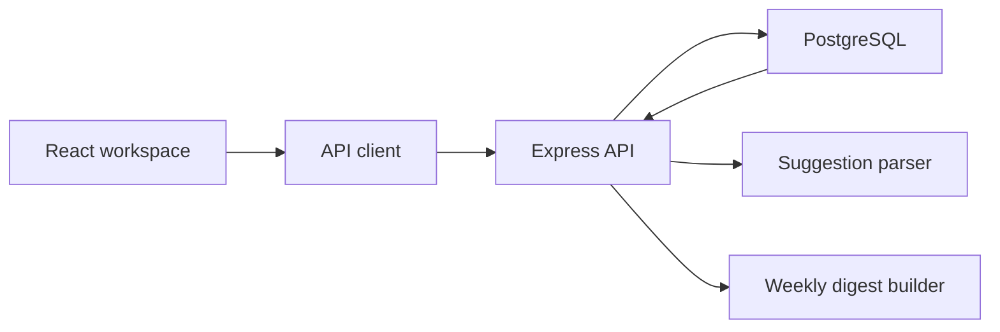

# ContextBoard Architecture

ContextBoard is a small monorepo with a React client, Node API, PostgreSQL schema, and shared TypeScript contracts. The product centers on a review queue: note-derived task suggestions are editable records until a reviewer accepts or dismisses them.

## System Shape

## Review Before Automation

Task suggestions are stored separately from accepted tasks. Reviewers can edit title, owner, status, due date, and source excerpt before converting a suggestion into a tracked task. This protects the workspace from silent automation drift while keeping source traceability.

## Deployment Model

The public demo is deployed as a static GitHub Pages build with seeded data. The API and PostgreSQL pieces are ready for hosted deployment on a Node-compatible service with `DATABASE_URL` configured.

## Data Model

- `notes` store the original shared text and tags.
- `task_suggestions` store reviewable candidates with confidence, rationale, status, and source excerpt.
- `tasks` store accepted work items and retain optional links back to suggestions and notes.
- `workspace_users` keep assignment metadata separate from notes and tasks.

This keeps dismissed suggestions auditable without polluting the active task board.
